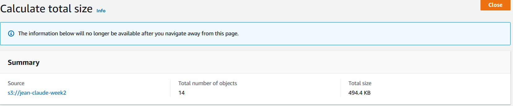
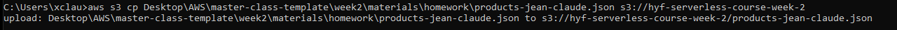
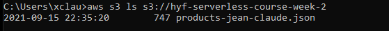
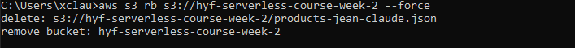

## Mandatory assignments

**Assignment 4:**

Sync your changes to s3 and write down your s3 bucket url.

bucket url: `http://jean-claude-week2.s3-website-us-east-1.amazonaws.com`

**Assignment 5:**

Right now, the website does not support https. Explain which other AWS service needs to be integrated in order to achieve this.

service name: `AWS Certificate Manager (ACM)`

**Assignment 6:**

Figure out and write down the price per month of storing 51TB on S3.

Price: `7385.63DKK`

Total size of website: `494.4kb`

**Assignment 7:**

Write down the main cost factors for S3

brief description: `S3 Standard /General purpose storage for any type of data, typically used for frequently accessed data`
|
----------------------------------------|
|First 50 TB / Month | $0.023 per GB |
|Next 450 TB / Month | $0.022 per GB |
|Over 500 TB / Month | $0.021 per GB |

**Assignment 8:**

The file `week2/assignments/products.json` needs to be uploaded Inside the bucket `hyf-serverless-course-week-2`. Upload the file through the CLI and write down the command needed.

docs:`https://docs.aws.amazon.com/cli/latest/reference/s3/cp.html`

| Command                                                                            | Note                                          |
| ---------------------------------------------------------------------------------- | --------------------------------------------- |
| `aws s3api create-bucket --bucket hyf-serverless-course-week-2 --region us-east-1` | Create bucket: `hyf-serverless-course-week-2` |
| `aws s3 ls`                                                                        | check buckets in s3 (look in s3)              |

|`aws s3 cp Desktop\AWS\master-class-template\week2\materials\homework\products-jean-claude.json s3://hyf-serverless-course-week-2`|upload `products-jean-claude.json` `hyf-serverless-course-week-2`|
|`aws s3 ls s3://hyf-serverless-course-week-2`|Check `products-jean-claude.json` in `hyf-serverless-course-week-2`|
|`aws s3 rb s3://hyf-serverless-course-week-2 --force` | delete file and remove bucket |

**Assignment 9:**
Write down a brief use case on when S3 could be used for a data engineering assignment:

use case: `company named abc is selling flight tickets, they want to save every month the number of tickets they sold.`

command:
|command|note|
|--------------------------------------|----------------------------|
|`aws s3api create-bucket --bucket abc-ticket-bucket --region us-east-1`|create bucket abc-ticket-bucket |
|`aws s3 cp january-tickets.xls s3://abc-ticket-bucket`|upload file for january-tickets |

## Optional assignments

**Assignment 10:**

What can be done to reduce the pricing for S3 when hosting a large number of files?

brief description:`https://aws.amazon.com/premiumsupport/knowledge-center/s3-reduce-costs/`

`Clean up incomplete multipart uploads.`
`Delete previous versions of objects that you don't need.`
`Review your storage-class transition costs.`
`Review your data retrieval costs.`
`Track the requests made to your bucket.`
`Check for changes in the size of your bucket.`
`Review the cost of individual buckets.`
`Understand how your usage relates to your charges.`

**Assignment 11:**

There are many security features built into S3. Find your favourite feature, documentation for it, and explain briefly why.

brief description of favourite security feature: `Encrypting Data at Rest and Transit`
`To protect data during rest and transit, enable encryption. You can set this up in AWS to encrypt objects on servers-sider before storing it in S3.`

`{ "Action": "s3:*", "Effect": "Deny", "Principal": "*", "Resource": "arn:aws:s3:::YOURBUCKETNAME/*", "Condition": { "Bool": { "aws:SecureTransport": false } } }`
